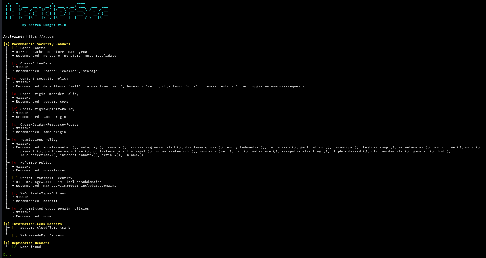

# HeaderSec

HeaderSec is a fast and modern tool written in Go for analyzing the security of HTTP response headers on websites.




# Features

HeaderSec can:

- Check for the presence of security headers
- Recommend the suggested values for each header
- Detect headers that may leak sensitive information
- Identify deprecated or insecure headers

# Installation


HeaderSec can be installed in different ways:

### Install via go install

```bash
go install github.com/andrealungh1/HeaderSec@latest
```

The HeaderSec binary will be placed in your `$GOPATH/bin` (or `$HOME/go/bin` by default). Make sure that directory is in your PATH.

### Run with Go

If you prefer to run from source:

```bash
git clone https://github.com/andrealungh1/HeaderSec.git
cd HeaderSec
go run HeaderSec.go -h
```


### Download Prebuilt Binaries

You can download precompiled binaries from the [Releases](https://github.com/andrealungh1/HeaderSec/releases/) page (Linux, macOS, Windows).

```bash
# Example for Linux x86_64
wget https://github.com/andrealungh1/HeaderSec/releases/download/v1.0.1/HeaderSec-linux-amd64
chmod +x HeaderSec-linux-amd64
./HeaderSec-linux-amd64
```

---

### Run with Docker

You can also build and run HeaderSec using Docker:

```bash
docker build -t headsec .
docker run --rm headsec -h
```

### Usage

Use the `-h` flag to display all the options.

```

Usage: HeaderSec -url <URL> [options]

Target selection:
  -url string
        URL to check
  -url-file string
        Text file with one URL per line
  -port int
        Override port
  -proxy string
        Proxy URL, e.g. http://127.0.0.1:8080
  -insecure
        Skip TLS certificate verification

Request customization:
  -method string
        HTTP method to use (default "HEAD")
  -cookie string
        Cookie in the format k=v
  -user-agent string
        Custom User-Agent string
  -H string
        Extra headers, format: 'K: V;K2: V2'

Redirect and timeout:
  -follow-redirects
        Follow HTTP redirects (default true)
  -max-redirects int
        Maximum number of redirects to follow (default 10)
  -timeout int
        Request timeout in seconds (default 10)

Scan behavior:
  -concurrency int
        Number of concurrent workers (default 20)
  -rec
        Include only recommended headers check
  -leak
        Include only info-leaking headers check
  -depr
        Include only deprecated headers check

Output:
  -json string
        Output JSON file ('-' for stdout)
  -no-banner
        Don't print the ASCII banner at start-up
  -no-color
        Disable ANSI colours in output

```


## Contributing

If you find a bug or would like to contribute to HeaderSec, please open an issue first so we can discuss it before you submit a pull request.


